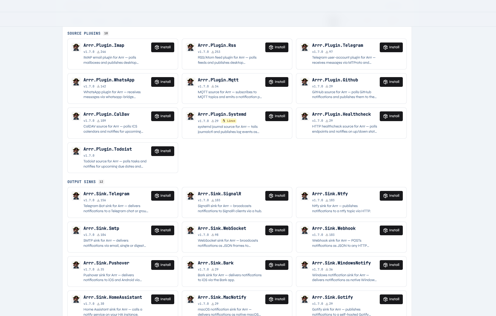
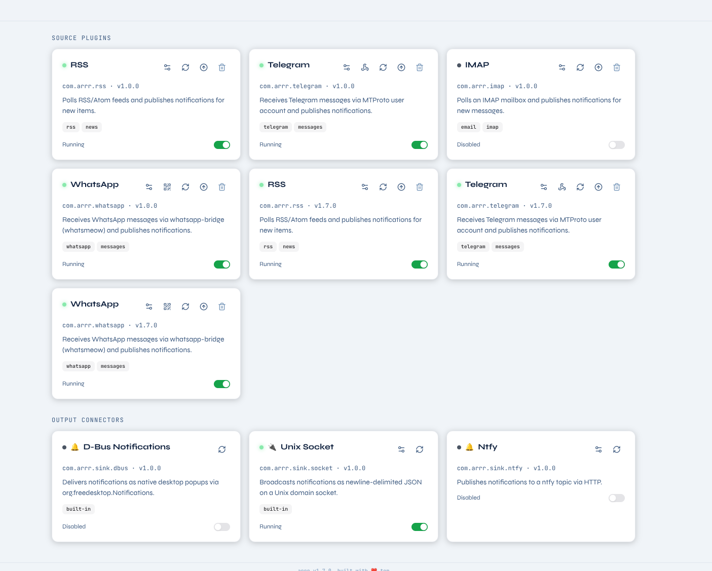

# Arrr! ☠️

<p align="center">
  
</p>

> *Arrr!* — because every good notification deserves a pirate's welcome.

## Why does this exist?

There are already plenty of tools that forward notifications: ntfy, Gotify, Pushover, Apprise, and a dozen others. **Arrr is not trying to replace or replicate any of them.**

The problem I wanted to solve is simpler and more specific: I have notifications coming from many different places — RSS feeds, Telegram, WhatsApp, email, GitHub, calendar reminders, task due dates — and I had no single place where I could see all of them together. Every source lived in its own app, its own window, its own silo. I'd miss things, or I'd have to check six places just to know what happened.

**Arrr's only job is aggregation.** One daemon that pulls from every source I care about, puts everything into a single stream, and lets me consume that stream however I want — as a desktop popup, an email digest, a push notification, or just a history log I can search later. The digest feature in particular was the tipping point: I don't want to be interrupted by every single RSS item, but I do want a morning summary of what came in overnight.

That's it. No cloud account, no mobile app, no SaaS. A daemon that runs on my Linux machine, knows about all my sources, and keeps everything in one place.

---

Arrr runs as a background service, collects notifications from multiple sources via a plugin system, and delivers them to your desktop through D-Bus and configurable sink plugins. A built-in web UI lets you browse notification history, manage plugins and sinks, and tweak settings — all from a browser.

## Screenshots

<p align="center">
  
  <br/><em>Web UI — plugin and sink management</em>
</p>

<p align="center">
  
  <br/><em>Web UI — plugin cards with status and controls</em>
</p>

---

## Features

- **Plugin system** — load notification sources from external `.dll` assemblies at runtime; each plugin runs in isolation and can't crash the daemon
- **Sink system** — fan-out to any number of destinations: desktop popups, email, push notifications, webhooks, and more
- **Web UI** — React dashboard for history, plugins, sinks, logs, and config
- **Notification history** — optional SQLite-backed history with full-text search, source filter, and pagination (encrypted at rest)
- **D-Bus delivery** — notifications appear as native desktop popups via `org.freedesktop.Notifications`
- **REST API** — HTTP endpoints to send notifications from any language and manage plugins/sinks
- **gRPC streaming** — server-streaming endpoint so remote clients (e.g. a PC) can subscribe to live notifications over the network
- **Routing rules** — filter or redirect notifications by source, title, body, priority, extras, and time-of-day; first-match-wins, disabled by default
- **Do Not Disturb** — pause all sink delivery with a single toggle (REST or gRPC), without stopping sources
- **Digest** — schedule batched notification summaries (hourly, daily, …) delivered via any sink
- **Deduplication** — configurable time window to suppress duplicate notifications
- **NuGet installer** — install community plugins directly from NuGet.org via the API or web UI
- **Docker image** — `tgiachi/arrr` on Docker Hub; first-start API key generation, `/data` volume for persistence
- **systemd user service** — runs as a user unit, logs to the journal
- **Self-contained binary** — no .NET runtime required on the target machine

---

## Architecture

```
┌──────────────────────────────────────────────────────────────┐
│                        Arrr.Service                          │
│                                                              │
│  Source Plugins ──┐                                          │
│  REST /api/notify ┼──▶  EventBus ──▶  SinkOrchestrator ──▶ D-Bus popup
│                   │         │              │                 │ ──▶ Ntfy / SMTP / Pushover
│                   │         │         RoutingRules           │ ──▶ Webhook / WebSocket
│                   │         │         DnD guard              │ ──▶ SignalR hub
│                   │         │              │                 │ ──▶ … (sink plugins)
│                   │         │         HistoryService         │
│                   │         │                                │
│                   │         └──▶  NotificationGrpcService   │
│                   │                    │                     │
│                                  gRPC stream :5150           │
└──────────────────────────────────────────────────────────────┘
                          │
                    Web UI :5150
```

1. The daemon starts and loads plugins from the configured `plugins/` directory.
2. Each plugin receives an `IPluginContext` (event bus, logger, shared HTTP client, per-plugin config) and runs on its own task.
3. Plugins publish `Notification` events onto the internal event bus.
4. `SinkOrchestrator` evaluates routing rules and the DND flag, then fans matching notifications out to enabled sinks.
5. If `historyEnabled: true`, every notification is persisted to an encrypted SQLite database.
6. `NotificationGrpcService` streams events (notifications and DND changes) to all connected gRPC clients.
7. External processes can inject notifications via `POST /api/notify`.

---

## Getting Started

### Install from AUR (Arch Linux)

| Package | AUR | Description |
|---------|-----|-------------|
| `arrr-bin` | [](https://aur.archlinux.org/packages/arrr-bin) | Pre-built binary (fast install) |
| `arrr-git` | [](https://aur.archlinux.org/packages/arrr-git) | Built from latest git HEAD |

```bash
# Pre-built binary (fast):
yay -S arrr-bin

# Build from source (latest git HEAD):
yay -S arrr-git
```

### Install from package

Download the latest `.deb`, `.rpm`, or `.pkg.tar.zst` from the [releases page](https://github.com/tgiachi/Arrr/releases).

**Debian / Ubuntu**
```bash
sudo dpkg -i arrr_<version>_amd64.deb
```

**Fedora / RHEL**
```bash
sudo rpm -i arrr-<version>-1.x86_64.rpm
```

**Arch Linux (manual)**
```bash
sudo pacman -U arrr-<version>-1-x86_64.pkg.tar.zst
```

### Docker

```bash
docker run -d \
  --name arrr \
  -p 5150:5150 \
  -v arrr-data:/data \
  tgiachi/arrr:latest
```

On first start Arrr prints a randomly generated API key to the log. Pass `ARRR_API_KEY` to use a fixed key:

```bash
docker run -d \
  --name arrr \
  -p 5150:5150 \
  -v arrr-data:/data \
  -e ARRR_API_KEY=my-secret-key \
  tgiachi/arrr:latest
```

> D-Bus and Unix socket sinks are disabled in the Docker image. Use Ntfy, SMTP, Webhook, or gRPC clients to receive notifications from a containerised instance.

### Enable the systemd user service

```bash
systemctl --user enable --now arrr
journalctl --user -u arrr -f
```

The web UI is available at `http://localhost:5150` once the service is running.

### Build from source

```bash
git clone https://github.com/tgiachi/Arrr
cd Arrr
dotnet build -c Release
```

Run directly:
```bash
dotnet run --project src/Arrr.Service -- --rootDirectory ~/.local/share/arrr
```

---

## Starting the service

Once installed (or built from source), the daemon is a single self-contained binary:

```bash
# Run in the foreground (useful to check the first-run output)
arrr

# Common flags
arrr --logLevelType Debug        # verbose logging
arrr --rootDirectory /custom/dir # use a non-default data directory
arrr --logToFile false           # console only, no rolling log files
```

On first start Arrr generates a random API key and writes it to the log. Note it down and put it in the web UI settings or in `arrr.config` — it is required for every API call and for `arrr-tray` to connect.

The service exposes a single port (default **5150**):
- `http://localhost:5150` — web UI and REST API
- `http://localhost:5150/stream` — SignalR hub (used by `arrr-tray` and the built-in stream view)

Once running, open `http://localhost:5150` in your browser to install plugins, configure sinks, and browse notification history.

---

## arrr-tray (Linux)

`arrr-tray` is a lightweight Linux system tray application that connects to a running Arrr service and delivers notifications to your desktop via **D-Bus** (`org.freedesktop.Notifications`) — the same mechanism used by your notification daemon (Dunst, Mako, SDDM, etc.).

**What it does:**

- Sits in the system tray and shows whether the service is connected or not
- Forwards every notification received from the service to the desktop as a native popup
- Uses the plugin's icon for the popup when available, falls back to a default icon
- Sends a "Connected" desktop notification when it (re)connects to the service
- Lets you toggle **Do Not Disturb** from the tray menu without opening a browser
- Shows an **About** window with tray and service versions

**What it does NOT do:**

- It does not run the Arrr service itself — you need the daemon running separately
- It does not store or search notification history — use the web UI for that

**Install (Arch Linux):**

```bash
yay -S arrr-tray-bin   # or arrr-tray-git for latest HEAD
```

**Or build from source:**

```bash
dotnet build src/Arrr.Tray -c Release
```

**First-time setup:**

1. Start `arrr-tray` — it appears in the system tray
2. Right-click → **Settings**
3. Set **Server URL** (e.g. `http://localhost:5150`) and **API Key**
4. Click **Save** — the tray reconnects immediately

> `arrr-tray` is currently Linux-only. It requires a D-Bus session bus and a compatible notification daemon.

---

## Documentation

| Doc | Description |
|-----|-------------|
| [Configuration](docs/configuration.md) | Config file reference, data directory layout |
| [REST API](docs/rest-api.md) | All HTTP endpoints with examples |
| [SignalR streaming](docs/signalr.md) | Live event streaming for clients |
| [Routing Rules](docs/routing.md) | Filter and redirect notifications by source, time, priority |
| [Writing a Plugin](docs/writing-a-plugin.md) | Build your own source or sink plugin |

---

## Available Source Plugins

| Plugin | NuGet | Description |
|--------|-------|-------------|
| **RSS / Atom** | [](https://www.nuget.org/packages/Arrr.Plugin.Rss) | Polls RSS/Atom feeds and notifies on new items |
| **IMAP** | [](https://www.nuget.org/packages/Arrr.Plugin.Imap) | Monitors an IMAP mailbox and notifies on new mail |
| **Telegram** | [](https://www.nuget.org/packages/Arrr.Plugin.Telegram) | Receives Telegram messages via MTProto (WTelegramClient) |
| **WhatsApp** | [](https://www.nuget.org/packages/Arrr.Plugin.WhatsApp) | Receives WhatsApp messages via whatsmeow bridge (QR pairing in UI) |
| **GitHub** | [](https://www.nuget.org/packages/Arrr.Plugin.Github) | Polls GitHub notifications (mentions, reviews, CI, etc.) |
| **CalDAV** | [](https://www.nuget.org/packages/Arrr.Plugin.CalDav) | Polls ICS calendars and notifies for upcoming events |
| **Healthcheck** | [](https://www.nuget.org/packages/Arrr.Plugin.Healthcheck) | Polls HTTP endpoints and notifies on up/down state changes |
| **MQTT** | [](https://www.nuget.org/packages/Arrr.Plugin.Mqtt) | Subscribes to MQTT topics and emits a notification per message |
| **systemd Journal** | [](https://www.nuget.org/packages/Arrr.Plugin.Systemd) | Tails `journalctl` and publishes log events as notifications |
| **Todoist** | [](https://www.nuget.org/packages/Arrr.Plugin.Todoist) | Polls Todoist tasks and fires alerts for due dates and reminders |

---

## Available Sinks

| Sink | NuGet | Description |
|------|-------|-------------|
| **D-Bus** | built-in | Native desktop popups via `org.freedesktop.Notifications` |
| **Ntfy** | [](https://www.nuget.org/packages/Arrr.Sink.Ntfy) | Push to a [ntfy](https://ntfy.sh) topic |
| **SMTP** | [](https://www.nuget.org/packages/Arrr.Sink.Smtp) | Send notifications by email (single or digest mode) |
| **Gotify** | [](https://www.nuget.org/packages/Arrr.Sink.Gotify) | Push to a self-hosted [Gotify](https://gotify.net) server |
| **Pushover** | [](https://www.nuget.org/packages/Arrr.Sink.Pushover) | Push to iOS/Android via [Pushover](https://pushover.net) |
| **Bark** | [](https://www.nuget.org/packages/Arrr.Sink.Bark) | Push to iOS via the [Bark](https://bark.day.app) app |
| **Telegram Bot** | [](https://www.nuget.org/packages/Arrr.Sink.Telegram) | Send notifications to a Telegram chat via Bot API |
| **Home Assistant** | [](https://www.nuget.org/packages/Arrr.Sink.HomeAssistant) | Call a HA `notify` service |
| **Webhook** | [](https://www.nuget.org/packages/Arrr.Sink.Webhook) | POST notifications as JSON to any HTTP endpoint |
| **WebSocket** | [](https://www.nuget.org/packages/Arrr.Sink.WebSocket) | Broadcast JSON frames to connected WebSocket clients |
| **SignalR** | [](https://www.nuget.org/packages/Arrr.Sink.SignalR) | Broadcast to SignalR clients via a hub |
| **macOS Notify** | [](https://www.nuget.org/packages/Arrr.Sink.MacNotify) | Native macOS notifications via `osascript` |

---

Want to build your own plugin? See [docs/writing-a-plugin.md](docs/writing-a-plugin.md).

---

## License

MIT — see [LICENSE](LICENSE).
